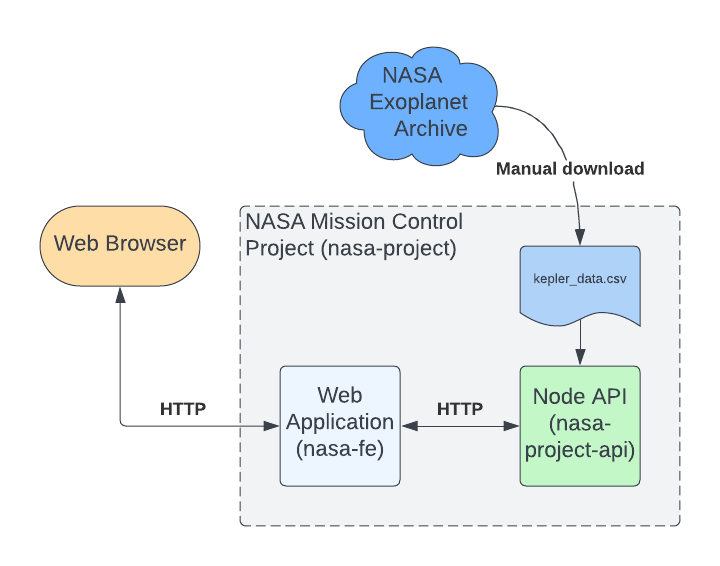

# NASA Project

Fullstack application for controlling space missions and enabling seamless exploration beyond our planet. 🌌🛰️<br />
Build with Node.js and React Application, a powerful combination for building dynamic and scalable web applications with seamless server-side functionality

**About this Repository**<br />
This project is part of the [Complete NodeJS Developer](https://www.udemy.com/course/complete-nodejs-developer-zero-to-mastery/) course from [Zero To Mastery](https://zerotomastery.io/). It functions as a practical example showcasing the steps involved in creating a comprehensive fullstack project, with a particular emphasis on developing the backend server and seamlessly integrating APIs with the client.

**TL;DR**

```bash
  npm run install # install client and server dependencies
  npm run watch # start the client and server applications

  # Visit localhost:3000 to interact with the application
```

# Project structure

The project consists of 3 npm packages

- **_nasa-fe_**: This package represents the client-side React application. While not actively developed within the project, its source code has been provided, and only API integration has been implemented.
- **_nasa-project-api_**: This package serves as the server-side Node.js/Express application and is the primary focus of this project.
- **_nasa-project_**: This is the root project that manages both the client and server components.

**Architecture Diagram**<br />


To initiate the application in development mode, execute the following command in the project's root directory: `npm run watch`<br />
This command will launch the server on port 8000 and the client on port 3000. Make sure all the (client and server) dependencies are installed with `npm run install`.

## Client

The React application has been bootstrapped using [Create React App](https://create-react-app.dev/) and constructed with the [arwes](https://arwes.dev/) framework. This application functions as a dashboard where users can create launches, explore upcoming missions, and review historical mission data.<br />
To exclusively access the frontend, execute the command `npm run client` in the project's root directory.

## Server

The server is implemented as a Node.js and Express application, utilizing Kepler data as its primary source for identifying habitable planets. The process is detailed in the [planet-explorer](https://github.com/ThomasCode92/planet-explorer) repository.<br />
In addition to utilizing Kepler data, the server maintains a record of all missions created and aborted by the user. This information is accessible to the user through a user-friendly API, providing comprehensive data about their mission launches.

### Development

When the application is launched with `npm run watch`, nodemon is employed to automatically reload the server whenever there are changes detected in the source code. This ensures a seamless development experience by facilitating real-time updates without manual intervention.

The following commands can be particularly beneficial during development:

```bash
  npm run install-server <PACKAGE_NAME> # install a package for the server
  npm run deploy # view the application as it would deploy on a real server
```

Executing the deploy command will initiate the server on port 8000. You can view the client application by visiting _localhost:8000_ in your browser. Additionally, the install-server command allows for the installation of a package specifically for the server, aiding in the management of server-side dependencies.

**Improving Performance**<br />
For better performance and the ability to manage increased request loads, the server can leverage [pm2](https://pm2.keymetrics.io/). PM2, a powerful tool designed for creating clusters, enables the deployment of multiple server instances. This clustering approach efficiently distributes the workload, optimizing resource utilization and thereby enhancing overall responsiveness.

```bash
  npm run deploy:cluster # view the (clustered) application as it would deploy on a real server
  npm run pm2 --prefix server <PM2 COMMAND> # Run a specific pm2 command on the server
```
